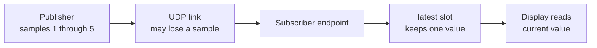

import Checklist from '../../../components/tutorial/Checklist.astro';
import MultipleChoice from '../../../components/tutorial/MultipleChoice.astro';

A sensor produces readings while a display wants the current temperature. In
this lesson, two independent programs exchange that value over localhost UDP.
No development board or virtual serial port is required.

**After this lesson, you can:**

- run a Wirelink publisher and subscriber;
- explain what `latest` retains after receipt;
- distinguish latest-value retention from unreliable delivery.

## Before you begin

Complete [development environment setup](../environment-setup/) first. That
lesson installs and verifies the compilers, CMake, Cargo, WLC, and standalone
Asio used below. Run the remaining commands from the Wirelink repository root.

## Build the example

Configure and build the tutorial programs:

```sh
cmake -S . -B build/tutorials -DCMAKE_BUILD_TYPE=Release \
  -DBUILD_TESTING=OFF \
  -DWIRELINK_BUILD_GETTING_STARTED=ON
cmake --build build/tutorials --config Release --parallel
```

CMake finds `wlc` and Asio from the environment prepared in the previous lesson.
It checks the WLC version and generated-code ABI before generating any C source.

## Run the two endpoints

Start the subscriber in terminal A:

```sh
./build/tutorials/examples/00_telemetry/telemetry_subscriber
```

After it prints `telemetry subscriber ready`, start the publisher in terminal B:

```sh
./build/tutorials/examples/00_telemetry/telemetry_publisher
```

The subscriber should print readings similar to:

```text
latest sample=1 temperature=23.50 C
latest sample=2 temperature=23.50 C
latest sample=3 temperature=23.50 C
latest sample=4 temperature=23.50 C
latest sample=5 temperature=23.50 C
```

UDP does not guarantee delivery, so every intermediate sample need not appear.
The subscriber exits after receiving sample 5 or reports a timeout after ten
seconds.

The link and the receiving endpoint make separate decisions. Loss can happen on
the UDP link; after a sample arrives, the `latest` slot replaces its older value:



:::note[Windows executable path]
Visual Studio multi-configuration builds place the executable under the
`Release` directory, for example
`build/tutorials/examples/00_telemetry/Release/telemetry_subscriber.exe`.
:::

## Describe the message

The example defines its data in
[`telemetry.wl`](https://github.com/starwey604/wirelink/blob/main/examples/00_telemetry/telemetry.wl):

```text
version 1;

message Telemetry @id(10) {
  required uint32 sample @id(1);
  required int32 temperature_centi_c @id(2);
}
```

This **schema**, or message definition, gives both endpoints the same field
names, types, and stable IDs. The endpoints encode those fields rather than
sending the memory layout of a C structure.

## Choose how received values are kept

The accompanying
[`telemetry.bind.wl`](https://github.com/starwey604/wirelink/blob/main/examples/00_telemetry/telemetry.bind.wl)
contains two independent choices:

```text
profile version 1;

latest Telemetry {
  delivery = unreliable;
}
```

- `latest Telemetry` keeps the last received value and replaces an older unread value.
- `delivery = unreliable` does not wait for a link acknowledgement or retransmit loss.

Latest-value retention describes storage **after receipt**. Unreliable delivery
describes what happens **on the link**. A frequently refreshed temperature can
often tolerate a lost intermediate reading, which is why this example combines
the two choices.

<MultipleChoice
  id="latest-versus-delivery"
  question="The publisher sends samples 3, 4, and 5 before the application reads again. All three reach the subscriber. Which value does latest retention return?"
  checkLabel="Check answer"
  choices={[
    {
      label: 'Sample 3, because it arrived first',
      correct: false,
      feedback: 'Latest retention replaces an unread older value when a newer value arrives.',
    },
    {
      label: 'Sample 5, because it arrived last',
      correct: true,
      feedback: 'Correct. Latest retention returns the most recently received value.',
    },
    {
      label: 'All three samples in order',
      correct: false,
      feedback: 'A FIFO retains an ordered sequence. Latest retention keeps one current value.',
    },
  ]}
/>

## Try one change

Open
[`publisher.c`](https://github.com/starwey604/wirelink/blob/main/examples/00_telemetry/publisher.c)
and change `value.temperature_centi_c` from `2350` to `2410`. Rebuild and run
both programs. The display should now report `24.10 C`.

This change confirms that the generated message carries the application value;
it does not change the retention or delivery policy.

<Checklist
  id="getting-started"
  title="Lesson complete"
  items={[
    'I can run the publisher and subscriber.',
    'I can explain which value latest retention keeps.',
    'I can distinguish retention from delivery.',
  ]}
/>

## Next step

[Request a result from a device](../request-a-result/) when a controller needs
one answer associated with one operation, rather than the current retained value.
