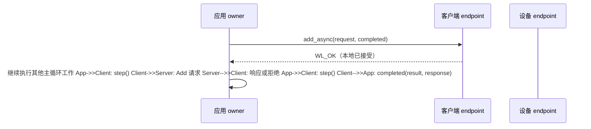

import Checklist from '../../../../components/tutorial/Checklist.astro';
import MultipleChoice from '../../../../components/tutorial/MultipleChoice.astro';

同步计算器调用会一直等待结果。命令行程序这样写很方便，但用户界面或设备主循环可能还要处理输入、刷新画面或执行控制任务，不能在等待期间停下来。

异步 RPC 把两个时刻分开：应用现在**提交调用**，稍后再收到**完成通知**。服务端和线上消息保持不变。

**完成本课后，你能够：**

- 提交 RPC 后立即取回控制权；
- 从应用主循环持续推进 endpoint；
- 在完成回调中复制调用结果与响应；
- 区分提交状态和 RPC 最终结果。

## 开始之前

请先完成[在调用结束后保存设备信息](../save-device-info/)。本课会复用此前 RPC 课程中的计算器 schema、服务端和 `build/tutorials` 构建目录。

更新源码后重新构建：

```sh
cmake --build build/tutorials --config Release --parallel
```

## 运行异步客户端

在终端 A 启动同一个计算器服务端：

```sh
./build/tutorials/examples/01_rpc/calculator_server
```

看到 `calculator server ready` 后，在终端 B 运行异步客户端：

```sh
./build/tutorials/examples/01_rpc/calculator_client_async
```

客户端会直接显示两个时刻：

```text
RPC submitted; main loop continues
RPC completion received
20 + 22 = 42
```

第一行在提交函数返回后输出；第二行来自完成回调。此后，客户端才打印业务结果。

这里没有创建后台线程。两行输出之间的应用主循环会持续推进 endpoint，直到回调执行。

本地提交与最终完成之间依赖应用主动推进。真实运行中可能需要调用多次 `step()`；下图只画出发送请求和接收结果的两次关键调用：



:::note[Windows 程序路径]
Visual Studio 多配置构建会把程序放在 `build/tutorials/examples/01_rpc/Release/` 下，并添加 `.exe` 后缀。
:::

## 对比两种调用方式

两个客户端调用同一个 `Add` 服务，也会得到相同结果。区别在于控制权什么时候回到应用：

| 调用方式 | 函数何时返回 | 最终结果出现在哪里 |
| --- | --- | --- |
| `calculator_endpoint_add_sync()` | 调用结束以后 | 函数返回结果与响应参数 |
| `calculator_endpoint_add_async()` | 本地提交以后 | 稍后执行的完成回调 |

异步提交不是发出后不管。一次已接受调用仍然需要存活的 endpoint、持续推进，以及在完成或有序关闭前始终有效的应用状态。

## 为稍后的结果准备状态

示例用一个由应用持有的结构体保存提交后需要的全部状态：

```c
typedef struct {
  bool done;
  wl_rpc_completion_t result;
  add_response_value_t response;
} addition_t;
```

`done` 告诉主循环何时停止等待；`result` 记录成功、拒绝、超时、取消或失败；调用成功时，自持 `response` 保存计算结果。

这个 `addition_t` 变量一直存在于 `main()` 中，直到 endpoint 关闭以后，因此 callback context 可以安全地指向它。

## 在回调中复制完成结果

生成的异步 API 会在完成时调用 `completed()`，并传入提交时提供的 context：

```c
static void completed(void *context, const wl_rpc_completion_t *result,
                       const add_response_value_t *response) {
  addition_t *addition = context;
  addition->result = *result;
  if (response != NULL) addition->response = *response;
  addition->done = true;
  puts("RPC completion received");
  fflush(stdout);
}
```

`result` 和 `response` 指针只在本次回调期间有效。回调返回前会复制两个值，沿用上一课学习的自持值语义。非成功结果没有响应，因此必须先检查空指针，再复制 response。

让完成回调保持简短：记录结果，然后由 owner 主循环决定下一步操作。

## 提交调用

异步客户端仍然使用相同请求值和 1500 毫秒等待预算：

```c
CHECK(calculator_endpoint_add_async(&client, &request, 1500U,
    completed, &addition, NULL) == WL_OK);
puts("RPC submitted; main loop continues");
fflush(stdout);
```

`calculator_endpoint_add_async()` 会在返回前保存请求快照。返回 `WL_OK` 表示本地 endpoint 已经接受这份快照；只要继续推进 endpoint 或有序关闭，应用之后会收到一次完成通知。它不表示设备已经成功处理请求。

如果提交返回错误，例如本地队列已满，就没有调用被接受，之后也不会执行完成回调。最后的 `NULL` 表示本例不需要用于主动取消的调用句柄。

| 观察位置 | 它能说明什么 |
| --- | --- |
| `add_async()` 的返回值 | 本地 endpoint 是否接受调用 |
| `completed()` 中的 `result.status` | 已接受 RPC 最终如何结束 |

<MultipleChoice
  id="async-submission-versus-completion-zh-cn"
  question="calculator_endpoint_add_async() 返回 WL_OK。此时可以确定什么？"
  checkLabel="检查答案"
  emptyFeedback="请先选择一个答案。"
  choices={[
    {
      label: '远端 handler 已经成功完成',
      correct: false,
      feedback: '远端执行结果稍后通过完成回调报告。',
    },
    {
      label: '本地 endpoint 已接受请求快照',
      correct: true,
      feedback: '正确。WL_OK 表示本地提交成功，回调才报告 RPC 最终结果。',
    },
    {
      label: '现在已经可以读取响应字段',
      correct: false,
      feedback: '只有收到成功完成通知后，响应才可用。',
    },
  ]}
/>

## 持续推进 endpoint

Wirelink 不会创建隐藏的工作线程。示例从应用主循环推进通信：

```c
while (!addition.done && example_running()) {
  const int step = calculator_endpoint_step(&client);
  if (step != WL_OK) fprintf(stderr, "endpoint: %s\n", wl_err_str(step));
  if (!addition.done) CHECK(example_udp_wait(udp, 200U) == WL_OK);
}
```

`calculator_endpoint_step()` 执行一次有界推进：服务传输、处理收到的数据、推进 deadline，并可能调用完成回调。随后 `example_udp_wait()` 会等待 UDP 就绪或短暂超时；仅仅等待不会推进 Wirelink。

调用 `step()` 的循环或线程是 endpoint 的唯一 **owner**。所有 endpoint 推进都应留在这个 owner 上。不要从完成回调中递归调用 `step()`、同步 RPC 或 `close()`。

如果 Ctrl+C 在调用未完成时停止循环，生成的 close 操作会先投递最终通知，再释放 UDP adapter。

<MultipleChoice
  id="async-needs-progress-zh-cn"
  question="调用已被接受，但应用始终不调用 step()，也不关闭 endpoint。它的回调会怎样？"
  checkLabel="检查答案"
  emptyFeedback="请先选择一个答案。"
  choices={[
    {
      label: '由隐藏的 Wirelink 线程完成',
      correct: false,
      feedback: 'Wirelink 不会为这个 endpoint 创建后台工作线程。',
    },
    {
      label: '继续等待，因为没有 owner 推进通信',
      correct: true,
      feedback: '正确。应用必须持续推进 endpoint，或者有序关闭它。',
    },
    {
      label: '回调会在 add_async() 内立即执行',
      correct: false,
      feedback: '提交只记录调用；后续 owner 推进才会投递完成通知。',
    },
  ]}
/>

## 观察异步业务拒绝

保持服务端运行，提交同步课程中使用过的溢出输入：

```sh
./build/tutorials/examples/01_rpc/calculator_client_async \
  49100 49101 2147483647 1
```

业务结果之前仍会出现相同的生命周期标记：

```text
RPC submitted; main loop continues
RPC completion received
addition rejected: status=1
```

客户端从同步改成异步以后，服务端和 `WL_RPC_REJECTED` 的含义没有变化。改变的是控制权何时返回，以及客户端从哪里取得最终结果。

## 添加一项主循环工作

在循环前添加 `unsigned passes = 0;`，并在每次循环中让它加一。完成以后打印：

```c
printf("owner passes=%u\n", passes);
```

具体次数取决于调度和网络时序，不要断言一个固定值。只要结果大于零，就能确认应用控制的 owner pass 确实发生在提交和最终结果之间。

<Checklist
  id="async-rpc-zh-cn"
  title="完成检查"
  progressTemplate="已完成 {done}/{total} 项"
  items={[
    '我能提交异步 RPC，并提供 callback context。',
    '我能区分本地提交状态与 RPC 最终结果。',
    '我会在回调返回前复制回调期间有效的数据。',
    '我会让 endpoint 只由一个 owner 循环推进。',
  ]}
/>

## 下一步

继续学习[在 RPC handler 返回后再回复](../deferred-rpc/)，让服务端现在接下请求、稍后再完成，同时避免耗时业务阻塞 endpoint owner。
