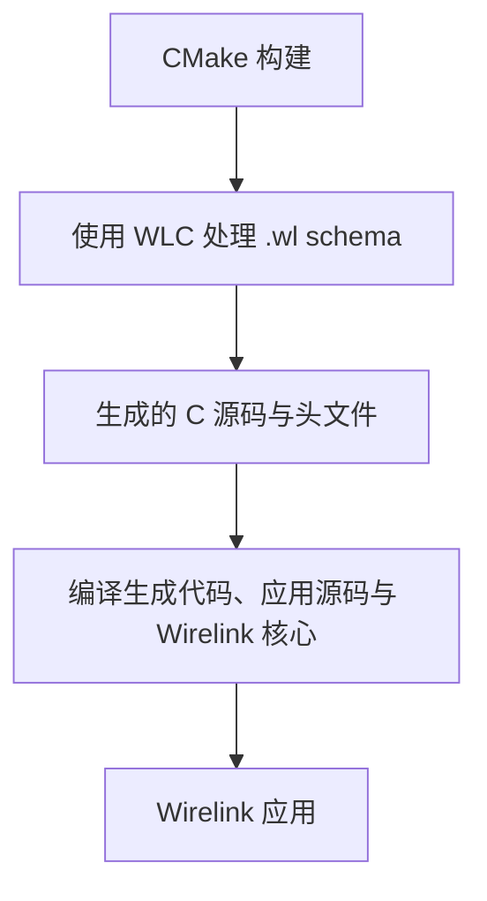

import { TabItem, Tabs } from '@astrojs/starlight/components';
import Checklist from '../../../../components/tutorial/Checklist.astro';
import MultipleChoice from '../../../../components/tutorial/MultipleChoice.astro';

Wirelink 应用是 C11 程序。WLC 是一个独立的主机工具，它先把 `.wl` 消息定义生成 C
源码，再由 C 编译器构建应用。把这两部分一次配置好，后续课程就可以直接开始编写和运行
Wirelink 程序。

**完成本课后，你能够：**

- 使用 CMake 构建 C11 和 C++20 程序；
- 在终端直接运行 Cargo 和匹配的 WLC 编译器；
- 让 CMake 自动找到 standalone Asio，不再额外传入路径。

## 理解构建路径

这些工具组成一条构建路径。CMake 负责协调代码生成与编译：



## 安装本机构建工具

最初几课需要 Git、CMake 3.21 或更新版本、C11 编译器、C++20 编译器，以及
standalone Asio。选择与你的系统对应的命令。

<Tabs syncKey="host-system">
  <TabItem label="Ubuntu / WSL">
    ```sh
    sudo apt update
    sudo apt install build-essential cmake git curl libasio-dev
    ```

    `build-essential` 会安装 GCC、G++ 和本机构建工具。这也是 Ubuntu 与 WSL 2 中
    Ubuntu 环境的最短配置路径。
  </TabItem>

  <TabItem label="Fedora">
    ```sh
    sudo dnf install gcc gcc-c++ cmake git curl asio-devel
    ```
  </TabItem>

  <TabItem label="macOS">
    先安装 Apple 命令行编译器，再使用 Homebrew 安装 CMake 和 Asio：

    ```sh
    xcode-select --install
    brew install cmake asio
    ```

    该环境使用 Apple Clang 代替 GCC；它支持教程需要的语言功能。
  </TabItem>
</Tabs>

:::note[原生 Windows]
Wirelink 也支持 Visual Studio 2022。请安装 **Desktop development with C++** 工作负载，
以及 Git、CMake 和 standalone Asio。学习路径使用 shell 命令；如果你还没有维护原生
CMake 环境，使用 WSL 2 中的 Ubuntu 会更直接。
:::

现在检查编译器别名和 CMake。最后一个命令应显示 CMake 3.21 或更新版本：

```sh
cc --version
c++ --version
cmake --version
```

## 安装 Rust 和 Cargo

[Rustup](https://rust-lang.org/tools/install/) 会一起安装当前稳定版 Rust 工具链和 Cargo。
在 Linux、WSL 或 macOS 中运行官方安装命令：

```sh
curl --proto '=https' --tlsv1.2 -sSf https://sh.rustup.rs | sh
```

选择默认的 stable 工具链。安装后打开新终端，或者在当前 shell 中载入新环境：

```sh
. "$HOME/.cargo/env"
cargo --version
```

原生 Windows 用户可以从同一个 Rust 页面运行 `rustup-init.exe`，然后重新打开
PowerShell。Rustup 默认把命令安装到 `%USERPROFILE%\.cargo\bin`。

## 安装匹配的 WLC 编译器

Wirelink 0.8.0 与 WLC 0.8.0、生成代码 ABI 32 配套。从 [WLC 发布页](https://github.com/starwey604/wlc/releases/tag/v0.8.0) 下载主机包，按 SHA256SUMS 校验后将可执行文件加入 PATH。若需从源码安装：

```sh
git -c core.autocrlf=false clone --branch v0.8.0 --depth 1 https://github.com/starwey604/wlc.git paired-wlc
cargo install --path paired-wlc --locked
```

命令会把 `wlc` 可执行文件放入 Cargo 的二进制目录，通常是 `$HOME/.cargo/bin`。
CMake 会从主机 `PATH` 中查找它，检查两个兼容性值，然后自动使用它。

:::caution[请使用上面的本地源码安装命令]
crates.io 上的 `wlc` 包名属于另一个 Wayland 项目。裸执行 `cargo install wlc` 不会安装
Wirelink schema 编译器。
:::

验证安装结果：

```sh
wlc --version
wlc codegen-abi
```

预期输出：

```text
wlc 0.8.0
32
```

如果系统找不到 `wlc`，请重启终端，并检查 Cargo 的二进制目录是否已经加入 `PATH`。

## 获取 Wirelink 源码

选择工作目录并克隆仓库：

```sh
git clone https://github.com/starwey604/wirelink.git
cd wirelink
```

运行一次小型核心构建，让编译器和 CMake 共同完成验证：

```sh
cmake -S . -B build/environment-check \
  -DCMAKE_BUILD_TYPE=Release \
  -DBUILD_TESTING=OFF \
  -DWIRELINK_BUILD_EXAMPLES=OFF
cmake --build build/environment-check --config Release --parallel
```

这个构建用于检查核心工具链。下一课会启用 UDP 教程，同时验证 WLC 和 Asio。

<MultipleChoice
  id="environment-wlc-discovery-zh-cn"
  question="完成环境配置后，Wirelink 的 CMake 构建如何选择 WLC？"
  checkLabel="检查答案"
  emptyFeedback="请先选择一个答案。"
  choices={[
    {
      label: '从主机 PATH 找到 wlc，再检查版本和生成代码 ABI',
      correct: true,
      feedback: '正确。只有两个兼容性检查都通过，构建才会复用已安装的编译器。',
    },
    {
      label: '直接使用 GCC 编译每一个 .wl 文件',
      correct: false,
      feedback: 'WLC 先读取 .wl 定义；GCC 随后编译生成的 C 源码。',
    },
    {
      label: '每次构建都下载最新 WLC 版本',
      correct: false,
      feedback: 'CMake 会先复用 PATH 中匹配的 wlc，也不会跟随未固定的最新版本。',
    },
  ]}
/>

<Checklist
  id="environment-setup-zh-cn"
  title="环境就绪检查"
  progressTemplate="已完成 {done}/{total} 项"
  items={[
    'CMake 显示 3.21 或更新版本。',
    'C 与 C++ 编译器可以从终端运行。',
    'Cargo 可以从终端运行。',
    'WLC 显示版本 0.8.0、生成代码 ABI 32。',
    'Wirelink 核心构建成功完成。',
  ]}
/>

继续学习[显示最新温度](../getting-started/)。
