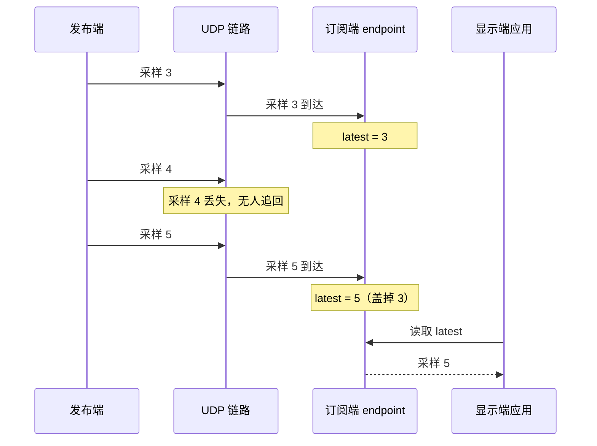

import Checklist from '../../../../components/tutorial/Checklist.astro';
import MultipleChoice from '../../../../components/tutorial/MultipleChoice.astro';

测温设备不断产生读数，显示端只关心当前温度。本课使用两个独立程序，通过本机 UDP 交换这个值。不需要开发板，也不需要虚拟串口。

**完成本课后，你能够：**

- 运行 Wirelink 发布端和订阅端；
- 解释 `latest` 在收到数据后保留哪个值；
- 区分 latest 值保留与 unreliable 投递。

## 开始之前

请先完成[开发环境配置](../environment-setup/)。上一课会一次安装并验证下文需要的编译器、CMake、Cargo、WLC 和 standalone Asio。后续命令都在 Wirelink 仓库根目录执行。

## 构建示例

配置并构建教程程序：

```sh
cmake -S . -B build/tutorials -DCMAKE_BUILD_TYPE=Release \
  -DBUILD_TESTING=OFF \
  -DWIRELINK_BUILD_GETTING_STARTED=ON
cmake --build build/tutorials --config Release --parallel
```

CMake 会从上一课准备好的环境中找到 `wlc` 和 Asio，并在生成任何 C 源码前检查 WLC 版本和生成代码 ABI。

## 运行两个 endpoint

先在终端 A 启动订阅端：

```sh
./build/tutorials/examples/00_telemetry/telemetry_subscriber
```

看到 `telemetry subscriber ready` 后，在终端 B 启动发布端：

```sh
./build/tutorials/examples/00_telemetry/telemetry_publisher
```

订阅端应显示类似输出：

```text
latest sample=1 temperature=23.50 C
latest sample=2 temperature=23.50 C
latest sample=3 temperature=23.50 C
latest sample=4 temperature=23.50 C
latest sample=5 temperature=23.50 C
```

UDP 不保证送达，所以中间的采样不一定全部出现。订阅端收到第 5 个采样后退出；十秒内没有收到则报告超时。

## 看清两次决定

发布端连续发出采样 1 到 5。采样 4 可能在 UDP 链路上丢失，也可能到达订阅端；决定它去留的是链路。采样到达订阅端以后，`latest` 只保留一个值，采样 5 会盖掉尚未读取的采样 3；决定保留哪个值的是订阅端。

这两次决定互不相干，下面把两个最坏情况画在一起：



:::note[Windows 程序路径]
Visual Studio 多配置构建会把程序放在 `Release` 目录，例如 `build/tutorials/examples/00_telemetry/Release/telemetry_subscriber.exe`。
:::

## 描述消息

示例在 [`telemetry.wl`](https://github.com/starwey604/wirelink/blob/main/examples/00_telemetry/telemetry.wl) 中定义数据：

```text
version 1;

message Telemetry @id(10) {
  required uint32 sample @id(1);
  required int32 temperature_centi_c @id(2);
}
```

这份 **schema（消息定义）** 给两个 endpoint 提供相同的字段名、类型和稳定编号。endpoint 编码这些字段，再按 Wirelink 的帧格式发送；对端解码得到的，是同样的类型化消息。

## 选择如何保留收到的值

配套的 [`telemetry.bind.wl`](https://github.com/starwey604/wirelink/blob/main/examples/00_telemetry/telemetry.bind.wl) 包含两个独立选择：

```text
profile version 1;

latest Telemetry {
  delivery = unreliable;
}
```

- `latest Telemetry` 保留最后收到的值；新值到达时，它盖掉尚未读取的旧值。
- `delivery = unreliable` 把每个采样直接发到链路上，一次发送，等待确认和重传都不做。

`latest` 描述数据**收到以后**怎么保存，`unreliable` 描述数据在**链路上**怎么发送。温度持续刷新，丢掉某个中间读数无所谓，所以本例把两者组合使用。

<MultipleChoice
  id="latest-versus-delivery-zh-cn"
  question="应用再次读取之前，发布端发送了采样 3、4、5，而且三个采样都到达了订阅端。latest 应返回哪个值？"
  checkLabel="检查答案"
  emptyFeedback="请先选择一个答案。"
  choices={[
    {
      label: '采样 3，因为它最先到达',
      correct: false,
      feedback: '新值到达时，latest 会替换尚未读取的旧值。',
    },
    {
      label: '采样 5，因为它最后到达',
      correct: true,
      feedback: '正确。latest 返回最近收到的值。',
    },
    {
      label: '按顺序返回全部三个采样',
      correct: false,
      feedback: 'FIFO 用于保留有序序列；latest 只保留一个当前值。',
    },
  ]}
/>

## 做一次修改

打开 [`publisher.c`](https://github.com/starwey604/wirelink/blob/main/examples/00_telemetry/publisher.c)，把 `value.temperature_centi_c` 从 `2350` 改为 `2410`。重新构建并运行两个程序，显示端应输出 `24.10 C`。

这个变化说明生成的消息携带了应用数据；它没有改变值保留或投递策略。

<Checklist
  id="getting-started-zh-cn"
  title="完成检查"
  progressTemplate="已完成 {done}/{total} 项"
  items={[
    '我能运行发布端和订阅端。',
    '我能解释 latest 保留哪个值。',
    '我能区分值保留与投递。',
  ]}
/>

## 下一步

当控制端需要取得某次操作对应的结果，而不是读取当前保留值时，继续学习[向设备请求计算结果](../request-a-result/)。
